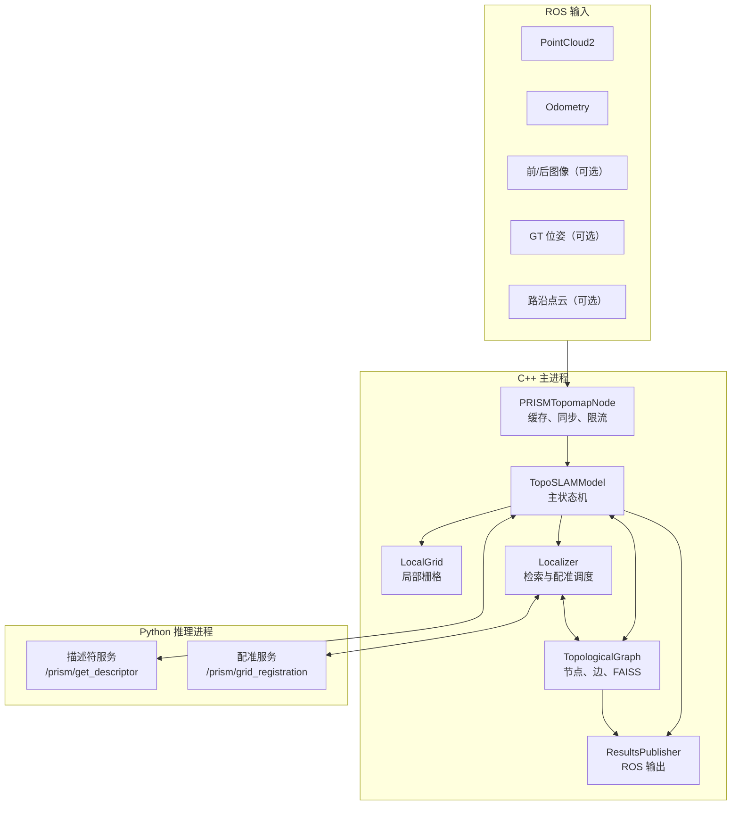
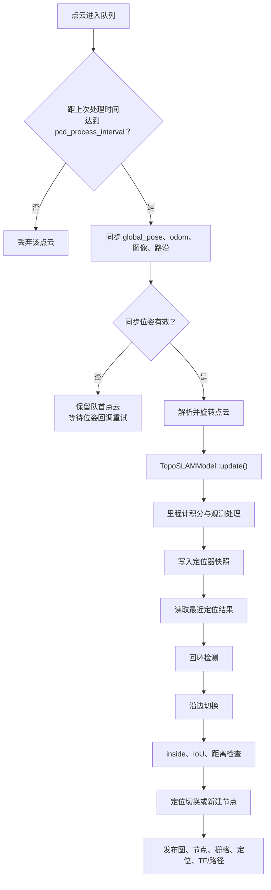
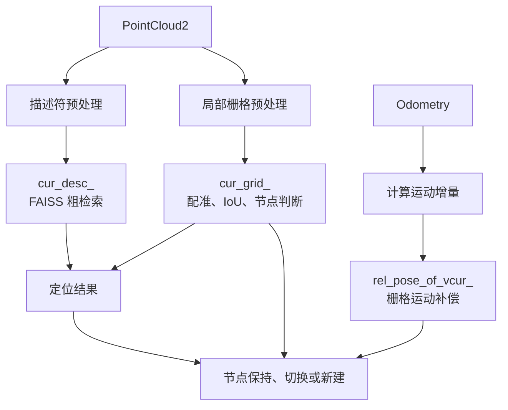
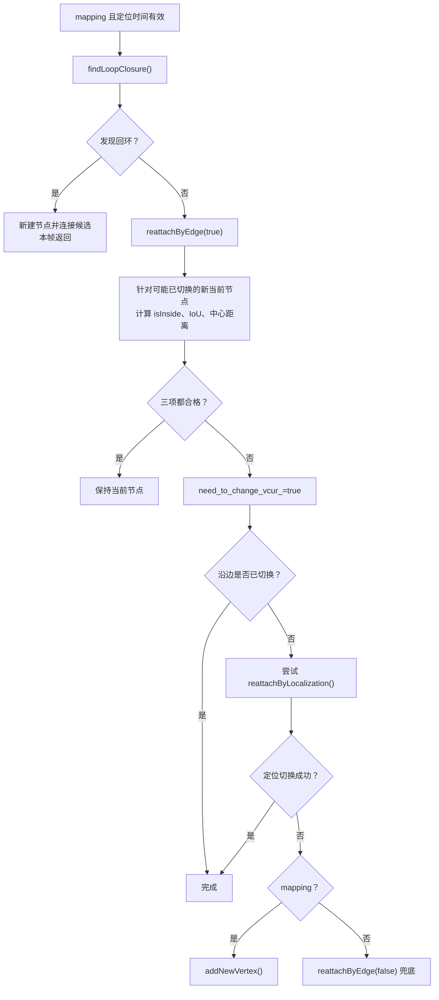
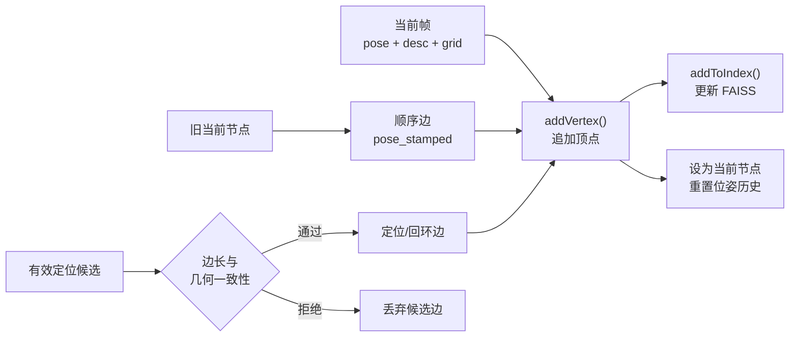
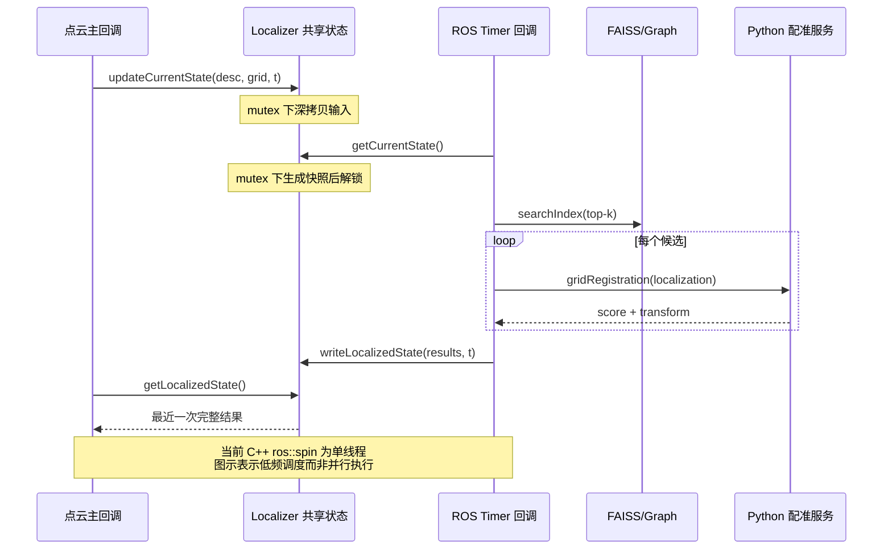

# PRISM-TopoMap 程序总体说明

> 本文依据当前工作空间代码编写。`analysis/00_system_overview.md`～`06_debug_summary.md`仅作为背景材料；凡分析材料、论文描述、Python 原始实现与当前 C++ 实现不一致之处，均以当前代码为准。重点代码入口为 `src/prism_topomap_node.cpp`、`src/topo_slam_model.cpp`、`src/local_grid.cpp`、`src/localizer.cpp`、`src/topological_graph.cpp` 和 `src/results_publisher.cpp`。

## 1. 项目背景与目标

PRISM-TopoMap 面向大范围室内、室外环境中的在线拓扑建图与定位。它不维护一张持续扩大的全局稠密栅格，而是把环境表示成“地点图”：每个顶点代表一个局部地点，保存该地点的全局可视化位姿、局部占据栅格和位置识别描述符；每条边保存两个地点之间的二维相对位姿。这样既能沿已知拓扑关系切换地点，也能通过描述符检索和局部栅格配准回到历史地点。

系统支持两种运行模式：

- `mapping`：从空图或已有图继续建图，允许创建节点、添加顺序边和回环/定位边。
- `localization`：加载已有图，只定位和切换当前节点，不应创建新节点或修改图。

系统同时保留纯 Python 原始实现和 C++/Python 混合实现。当前混合架构由 C++ 承担 ROS 接入、点云与栅格处理、状态机、拓扑图和 FAISS；Python 服务保留 PyTorch、MinkowskiEngine 和配准模型推理。

## 2. 系统总体架构



混合架构由 `launch/hybrid_mapping.launch` 或 `launch/build_map_by_iou_scout_rosbag_hybrid.launch` 同时启动 `inference_service_node.py` 与 `prism_topomap_cpp_node`。C++ 节点启动后最多等待推理服务 60 秒；任一服务不可用时，`run()` 返回，系统不进入 ROS 主循环。

## 3. 核心模块与数据结构

| 模块 | 主要文件 | 输入 | 输出与职责 |
|---|---|---|---|
| ROS 主节点 | `src/prism_topomap_node.cpp` | 点云、里程计、GT、图像、路沿、导航目标 | 缓存、时间同步、点云限流，调用 `TopoSLAMModel::update()`，组织发布 |
| 核心状态机 | `src/topo_slam_model.cpp` | 同步后的一帧观测 | 里程计积分、观测处理、回环检测、节点保持/切换/新建 |
| 局部栅格 | `src/local_grid.cpp` | 点云、栅格反向位移 | occupancy、density、height 等层，IoU 和区域包含判断 |
| 定位器 | `src/localizer.cpp` | 描述符、栅格、时间戳、拓扑图 | FAISS top-k、候选栅格配准、匹配节点及相对位姿 |
| 拓扑图 | `src/topological_graph.cpp` | 节点观测、边相对位姿 | 顶点数组、双向邻接表、FAISS 索引、Dijkstra、图存取 |
| 推理客户端/服务 | `src/inference_client.cpp`、`scripts/inference_service_node.py` | PointCloud2、图像或两张栅格 | 描述符；配准分数和像素变换 |
| 发布器 | `src/results_publisher.cpp` | 图、当前节点、栅格、定位和路径 | Marker、OccupancyGrid、PoseStamped、TF 等 ROS 消息 |

核心数据结构如下：

- `Pose2D`：`[x, y, theta]`，用于机器人、节点和边的二维位姿。
- `Vertex`：`pose_for_visualization + grid + descriptor`；节点 ID 就是其在 `vertices_` 中的下标。
- `AdjEntry`：邻居节点 ID 和从当前节点到该邻居的相对位姿。`addEdge()` 同时存正向边和逆变换后的反向边，因此逻辑上是无向图。
- `LocalizedState`：成功匹配节点、对应相对位姿、检索到但配准失败的节点、定位快照全局位姿与时间戳。
- `LocalGrid`：以 `cv::Mat` 保存多个同尺寸局部层；当前算法决策和配准实际使用 `occupancy`。

## 4. 系统总体运行流程



C++ 主节点不是 `message_filters` 的严格同步器，而是自行维护缓存并以点云时间戳为基准选取数据。点云是驱动帧；odom、GT、图像和路沿只提供与该点云配套的数据。本节只给出控制流程，消息形态、三层预处理和点云双支路详见第 5 节。

## 5. 一帧传感器数据的端到端执行过程

本节先说明原始数据“长什么样”，再沿着代码调用顺序说明它如何变成定位和拓扑建图真正使用的输入。这里的“一帧”以点云为中心，不表示所有传感器消息恰好同时到达。

### 5.1 一帧输入中包含哪些传感器数据

#### 5.1.1 三维点云 `sensor_msgs/PointCloud2`

点云是系统的驱动数据，也是唯一不可缺少的环境观测。现实中的一帧激光点云可以想象为 N 个三维采样点：

```text
[
  [x1, y1, z1],
  [x2, y2, z2],
  ...
  [xN, yN, zN]
]
```

例如 `[2.3, -1.1, 0.7]` 表示某个反射点位于传感器前后、左右和高度三个方向上的位置。真实雷达消息还可能带有 `intensity`（反射强度）、`ring`（激光线束编号）、`time`（点内时间）或 RGB。`PointCloud2` 并不直接把这些点保存成容易阅读的二维表，而是通过 `fields、point_step、row_step` 描述字段布局，实际数值连续存放在二进制 `data` 字节区。

当前 C++ 的 `getXyzCoordsFromMsg()` 使用 `pcl::fromROSMsg()` 按消息中的字段名提取 xyz，转换为 `pcl::PointCloud<pcl::PointXYZ>`；传入该函数的配置字符串 `fields` 当前没有参与分支，强度、ring、time 和 RGB 也不会进入后续 C++ 栅格算法。原始 `PointCloud2` 仍会完整发送给 Python 描述符服务，但该服务同样只用 `pc2.read_points(..., field_names=('x','y','z'))` 读取 xyz。

#### 5.1.2 里程计 `nav_msgs/Odometry`

Odometry 描述机器人在里程计坐标系中的连续运动，典型内容为：

```text
header.frame_id: "odom"
child_frame_id:  "base_link"
position:        {x, y, z}
orientation:     {x, y, z, w}    # 四元数
linear/angular velocity: ...
pose covariance: ...
```

本项目不使用 z、速度和协方差，只读取平面位置 x、y，并把四元数转换为 yaw，最终内部形态为 `[x, y, yaw]`。它不是地点识别结果，而是用于回答“机器人从上一处理帧移动了多少”。正常工作时 odom 应视为必需输入；代码在 odom 暂时缺失时可以回退到 `global_pose`，但若二者坐标系不同，这种回退可能产生错误增量。

#### 5.1.3 前后相机 `sensor_msgs/Image`

图像是可选输入，仅在 `subscribe_to_images=true` 时订阅。ROS Image 包含宽、高、编码、每行步长和二进制像素数据；彩色图像转换后通常可理解为 `H × W × 3` 数组，例如 `480 × 640 × 3`，最后一维是三个颜色通道。

混合架构先把原始 Image 随 Service 请求发送给 Python。`cv_bridge` 将其解码为 BGR8 数组，服务再执行 BGR→RGB、`HWC→CHW`，得到 `3 × H × W` Tensor，并增加 batch 维形成约 `1 × 3 × H × W` 的模型输入。图像只参与多模态地点描述，不参与 C++ occupancy 构建。同步不到图像时 C++ 不丢弃整帧，而是把 `has_image_front/back=false`；对应模型能否在缺图时维持预期精度取决于模型配置。

#### 5.1.4 GT 位姿

GT（ground truth）是外部系统给出的参考真值，可配置为 `geometry_msgs/PoseStamped` 或 `nav_msgs/Odometry`。消息同样含位置和四元数，回调最终只保留 `[x, y, yaw]`。GT 是可选数据，主要用于节点的全局可视化坐标、评估和几何诊断，不应替代连续 odom 积分。当前代码在 GT topic 缺失时回退到 odom 生成 `global_pose`，不会再因此阻塞点云队列。

#### 5.1.5 路沿点云

路沿数据也是 `PointCloud2`，但点集合只表示路沿检测器判定的边界点，例如：

```text
[
  [3.2, -1.4, 0.1],
  [3.3, -1.4, 0.1],
  ...
]
```

它是户外配准的可选几何提示。回调将其转为 PCL xyz 点云并按时间戳缓存。需要注意：当前 C++ `cur_grid_` 默认只创建 `occupancy、density_map、height_map`，没有创建 `curbs` 层，因此同步到路沿后虽然会调用 `updateCurbsFromCloud()`，实际不会写入任何 curbs 层；纯 Python 版本会按配置创建该层。

| 数据 | 正常运行是否必需 | 转换后的主要形态 | 当前用途 |
|---|---|---|---|
| PointCloud2 | 是 | PCL xyz 点云；Python N×3/Tensor | 描述符、局部栅格 |
| Odometry | 是；代码有临时回退 | `[x,y,yaw]` | 运动增量、节点内相对位姿 |
| 前后 Image | 否 | `H×W×3`，再到 `1×3×H×W` | 多模态描述符 |
| GT 位姿 | 否 | `[x,y,yaw]` | 节点全局可视化和诊断 |
| 路沿点云 | 否 | PCL xyz 点云 | 设计上更新 curbs；当前 C++ 未生效 |

### 5.2 什么叫“一帧完整观测”

各传感器由不同设备和 ROS 回调产生，不会同时抵达。假设缓存中有：

```text
点云       100.300 s
odom       100.295 s
前图像     100.310 s
GT         100.298 s
路沿       100.320 s
```

系统以点云的 `100.300 s` 为基准，调用 `getSyncPoseAndImages()` 从各缓存寻找时间上最近的数据。GT 在有前后包围样本时会插值；odom 取 0.2 秒容差内的最近值；图像和路沿取 0.5 秒容差内的最近值。同步不是把五类数据数值融合成一个向量，而是判断它们是否可视为同一时刻附近的观测，并把选中的消息一起交给 `TopoSLAMModel::update()`。

同步结果可以用下面的逻辑示意理解；它不是代码中真实存在的结构体，真实代码使用 `SyncResult` 加独立的点云参数：

```text
SyncedObservation {              # 逻辑示意
    timestamp:    100.300;
    global_pose:  [x, y, yaw];
    odom_pose:    [x, y, yaw];
    cloud_msg:    原始 PointCloud2;
    cloud_xyz:    PCL xyz 点云;
    front_image:  可选 Image;
    back_image:   可选 Image;
    curb_cloud:   可选 PCL 点云;
    valid_flags:  图像/路沿是否存在;
}
```

点云是驱动帧，其他消息都是配套数据。若 GT 缺失而 odom 有效，`global_pose` 回退到 odom；若图像或路沿没匹配到，仍可继续处理；若 GT 和 odom 都不能提供点云时刻附近的位姿，队首点云暂不出队，等待后续位姿回调再次尝试。

### 5.3 “预处理”包含三个不同层次

#### 第一层：消息级预处理

消息级预处理解决“这一整帧是否处理、应与哪些消息配套”，由 `PRISMTopomapNode` 完成：

1. 点云、odom、GT、图像、路沿分别进入各自回调和缓存。
2. 点云队列最多保留 50 帧，超限丢弃最旧帧；前后图像各最多保留 100 帧。
3. `processPcdQueue()` 按 `pcd_process_interval` 做整帧限流。两帧时间差太小，整条 PointCloud2 被弹出并丢弃。
4. 通过点云时间戳选择配套位姿、图像和路沿，并执行前述缺失数据降级。

“点云帧限流”和“点云内部降采样”必须区分。前者例如每 0.3 秒只处理一帧，会把不满足间隔的整帧十万个点全部丢弃；后者是在保留该帧的前提下，把十万个点缩减为较少的代表点。当前 C++ 主栅格支路没有调用 `voxelDownsample()`；描述符支路的稀疏体素量化属于一帧内部的数据缩减。

#### 第二层：点云解析和坐标预处理

同步成功后，`getXyzCoordsFromMsg()` 完成：

```text
PointCloud2 二进制 data
→ PCL 根据字段布局读取 x、y、z
→ 删除 NaN/Inf 点
→ 应用 rotation_matrix
→ 统一机器人坐标系中的 PCL xyz 点云
```

不同雷达可能约定 x 向右、y 向前，或安装时绕轴旋转；本项目后续算法约定统一的前、左、上方向。`rotation_matrix` 只改变同一个物理点的坐标表达，例如把传感器坐标 `[x_s,y_s,z_s]` 旋转为机器人坐标 `[x_r,y_r,z_r]`，不会移动真实墙体。原始消息保留给描述符服务，旋转后的 PCL 点云交给 C++ 栅格支路。

#### 第三层：算法输入预处理

同一帧点云从这里分成两条目的不同的支路：

```text
PointCloud2
├── 地点描述符支路 → cur_desc_
└── 局部几何支路   → cur_grid_
```

描述符支路保留原始 PointCloud2，是因为 Python 深度网络需要自行解析和体素化；局部栅格支路使用已清理、旋转到统一坐标系的 PCL xyz。也就是说，当前混合实现的 `rotation_matrix` 只作用于 C++ PCL/栅格支路，不会改写发送给描述符服务的原始消息；部署时需保证模型预期的点云轴向与传感器原始轴向一致。两条支路并不是重复计算同一个结果：前者提炼整体地点特征用于粗检索，后者保留二维几何结构用于精配准和节点判断。

### 5.4 描述符支路：从点集合到地点特征向量

`TopoSLAMModel::processObservations()` 通过 `/prism/get_descriptor` 同步调用 `InferenceServiceNode::handle_get_descriptor()`，实际步骤为：

1. 从 PointCloud2 二进制数据读取所有有限 xyz，形成 `N × 3` 的 `float32` 数组。
2. 为每个点构造值为 1 的单通道特征，即坐标描述“点在哪里”，初始点特征只表示“这里有一个点”。
3. MinkowskiEngine 按 `pointcloud_quantization_size` 做稀疏体素量化。若体素边长为 0.1 m：

   ```text
   点 [2.11, 0.31, 0.65]
   ÷ 0.1 → [21.1, 3.1, 6.5]
   离散到体素坐标 → 约 [21, 3, 6]
   ```

   附近的 `[2.14,0.34,0.62]` 可能落入同一体素；稀疏表示只保留一个占用位置及对应特征，从而减少网络输入规模。它不是 C++ 的整帧限流，也不改变该帧属于哪个时间戳。
4. 若前后图像有效，将 RGB、CHW、带 batch 维的图像 Tensor 一并加入模型输入。
5. 地点识别网络执行前向推理，将成千上万个局部点压缩为一个固定长度向量。MinkLoc3D 对应 256 维，MSSPlace 对应 512 维，例如：

   ```text
   cur_desc_ = [0.12, -0.08, 0.31, ..., 0.04]
   ```

该向量不是机器人坐标，不是栅格，也不是一张地图；单个分量通常没有可独立解释的物理意义。它概括当前地点的整体外观与几何特征。FAISS 对 `cur_desc_` 和历史节点描述符计算 L2 距离，找出最相似的 top-k 节点，再交给栅格配准验证。

通俗地说，描述符负责回答：**“我以前是不是来过一个看起来相似的地方？”**

若服务失败，C++ 清空 `cur_desc_`；低频定位会因描述符为空而跳过。本帧若仍被状态机创建为新节点，该节点保存空描述符，`addToIndex()` 也不会把它加入 FAISS。

### 5.5 局部栅格支路：从三维点到二维环境结构

`LocalGrid::updateFromCloudAndTransform()` 使用旋转后的 PCL xyz，按以下顺序更新 `cur_grid_`。

#### 5.5.1 旧栅格运动补偿

`cur_grid_` 在帧间复用，因此先用反向 odom 增量变换旧层。假设上一帧一面墙位于机器人前方 3.0 m，机器人向前移动 0.5 m；在当前机器人坐标系中，同一面墙应位于前方 2.5 m。也就是说：

```text
机器人向前移动 0.5 m
等价于旧环境在局部栅格中向后移动 0.5 m
```

`update()` 同时计算两个方向的量：正向增量用于更新 `rel_pose_of_vcur_`，反向 `grid_shift = getRelPose(cur_odom_pose, odom_pose_)` 传给栅格。当前实现随后会重建 occupancy 和 height，因此补偿的历史积累主要保留在 density；若 curbs 层存在，也会随旧栅格变换。

#### 5.5.2 删除无效点和范围过滤

局部栅格再次检查 xyz 有限性，并只保留 x、y 在 `(-max_range,max_range)` 内的点。例如 `max_range=8 m`：

```text
[NaN, 0.4, 1.0] → 无效，删除
[12.0, 1.0, 0.8] → 超出 x 范围，删除
[3.0, 2.0, 0.5]  → 有限且在范围内，保留
```

这里限制的是平面观测半径的方形边界，不是对整帧做时间限流。

#### 5.5.3 区分全部有效点与障碍点

范围过滤后的 `in_range` 保留全部有效点；`removeFloorAndCeil()` 另生成 `obstacles` 子集，只保留 z 位于 `floor_height` 与 `ceiling_height` 之间的点。假设阈值为 0.2 m 和 2.5 m：

```text
z = 0.02 m → 近地板，不作为二维障碍点
z = 0.70 m → 墙、桌腿等，作为障碍点
z = 2.80 m → 近天花板，不作为二维障碍点
```

地板和天花板点并非从所有后续步骤彻底消失：`in_range` 的全部点仍用于当前帧的观测单元和 `height_map`；只有最终标记 occupancy=2 和统计 `density_map` 时使用 `obstacles`。

#### 5.5.4 三维点投影到二维格子

投影用 x、y 决定平面单元，z 不参与二维索引。若 `resolution=0.1 m`、`radius=18 m`，栅格为 `360×360`，机器人位于中心约 `[180,180]`。点 `[2.3,-1.1,0.7]` 映射为：

```text
i = round(2.3 / 0.1) + 180  = 203
j = round(-1.1 / 0.1) + 180 = 169
```

因此其平面位置写入 `[203,169]`，z=0.7 可参与该单元 `height_map` 的最大高度统计。多个三维点可以落入同一个二维格子。

#### 5.5.5 `raycastGrid()` 填充可见自由区域

仅把激光命中点投影到图上还不能说明机器人和命中点之间是否可走。raycast 从栅格中心沿约 1000 个方向发射离散射线：机器人到最远观测点之间被激光穿过，视为已观测自由空间；障碍命中格最终标为障碍；障碍物之后没有被该束激光观察，保持未知。

```text
R  1  1  1  2  0  0
```

其中 R 是机器人，1 是射线经过的已观测自由区域，2 是障碍物，0 是障碍物后的未知区域。occupancy 的程序语义为：

- 0：未知或未观察；
- 1：已观察自由区域；
- 2：障碍物。

#### 5.5.6 其他栅格层

- `density_map`：统计每个格子的障碍点数量，并以 `旧值 × obstacles_attenuation + 当前计数` 衰减累加，反映障碍观测密度。
- `height_map`：对全部范围内有效点取每格最大 z；当前帧会重建该层。
- `curbs`：设计上按类似方式衰减累积路沿点。当前 C++ 默认层没有 `curbs`，所以混合版本中尚未真正生效；Python 版本会按配置添加。

通俗地说，局部栅格负责回答：**“当前环境的二维结构是什么，我与历史节点的局部地图有多重合？”**

### 5.6 预处理结束后的真正算法输入

原始传感器经过同步、解析和两条算法支路后，后续定位与拓扑状态机主要使用：

| 结果 | 数据形态 | 后续用途 |
|---|---|---|
| `Δodom` | `[dx,dy,dyaw]` | 更新机器人相对当前节点的运动，并给栅格反向补偿 |
| `cur_desc_` | 256/512 维 float 向量 | FAISS 粗检索历史相似节点 |
| `cur_grid_` | 多层二维 `cv::Mat` | 栅格精配准、IoU、inside 和节点归属 |
| `global_pose` | `[x,y,yaw]` | 新节点全局可视化坐标及几何诊断 |
| `timestamp` | 秒 | 对齐低频定位快照与当前机器人位姿 |



这一步之后，算法不再直接用“十万个原始点”决定当前属于哪个拓扑节点，而是用描述符给出候选、用局部栅格验证几何、用 odom 维持连续运动，并用时间戳消除定位延迟。

### 5.7 预处理之后：定位、节点决策与发布

#### 5.7.1 向定位器写入当前状态

`localizer_.updateCurrentState(global_pose, cur_desc_, cur_grid_, t)` 在 mutex 下复制描述符、栅格和时间戳，形成下一次定位使用的最新状态。随后主状态机把 `{t, rel_pose_of_vcur_}` 追加到 `rel_poses_stamped_`，用于将较早定位结果补偿到当前时刻。

若 `last_vertex_id_ < 0`：

- mapping 模式立即 `addNewVertex({}, {})`，第一个节点 ID 通常为 0，然后本帧返回；
- localization 模式调用 `initLocalization()`：有 `start_location` 时直接挂到指定节点，否则立即做一次定位；未成功则返回并等待后续帧重试。

#### 5.7.2 低频定位回调执行检索和配准

ROS Timer 调用 `Localizer::localize()`。它先在 mutex 下复制完整快照，之后不再持锁进行耗时计算：

1. 空描述符直接跳过；
2. `TopologicalGraph::searchIndex()` 用 `faiss::IndexFlatL2` 搜索 top-k；
3. 对每个候选节点，将当前 occupancy 与候选节点 occupancy 发送给 `/prism/grid_registration`，类型为 `localization`；
4. Python 服务按配置运行配准模型，返回分数、像素平移和旋转；
5. 分数不低于阈值的候选由 `getTfMatrixXY()` 转成米制 `[x,y,theta]`；
6. `writeLocalizedState()` 在 mutex 下整体替换匹配、未匹配、相对位姿和快照时间戳。

需要严格指出：分析材料把 C++ 版本称为独立“定位线程”，但当前 `run()` 使用单线程 `ros::spin()`，没有 `AsyncSpinner` 或 `std::thread`。因此 C++ Timer 与点云回调在同一回调队列中串行执行，定位回调及其同步 Service 调用会阻塞其他 C++ 回调；mutex 使接口具备线程安全形式，也支持未来改为多线程 spinner。纯 Python 的 `rospy.Timer` 才会在独立 Timer 线程中回调。

#### 5.7.3 主循环读取最近一次完整定位结果

除首节点初始化帧外，`update()` 调用 `getLocalizedState()`，在 mutex 下取得最近一次完整的 `localization_results_`。结果可能不是当前帧产生的，而是时间戳 `t_loc` 的旧快照。

若 `t_loc` 不早于 `rel_poses_stamped_` 当前坐标系历史的起点，则视为可用的新鲜结果，并令 `rel_pose_vcur_to_loc_ = getRelPoseFromStamp(t_loc)`。该量记录定位快照时机器人相对旧当前节点的位置。之后 `getRelPose(rel_pose_vcur_to_loc_, rel_pose_of_vcur_)` 可得到从定位时刻到当前时刻的运动，避免用旧定位结果把机器人“拉回过去”。

#### 5.7.4 回环检测、沿边切换和节点保持判断

当前代码的真实顺序不是论文常用的“先保持、再切换”，而是：



`findLoopClosure()` 遍历定位候选对。旧图最短路径需大于 5 米、且大于“当前位置经两候选连接”的估计长度两倍，并通过 `checkPathCondition()`，才设置 `found_loop_closure_=true`、保存旧路径并创建一个位于当前观测的新节点闭环。它不是直接给两个历史节点加边。

若未触发回环，`reattachByEdge(true)` 每帧都先检查当前节点邻居：只有机器人更接近某邻居中心、且预测距离小于硬编码 5 米时，才粗对齐栅格并执行 `inline` 配准；配准修正量还必须小于 `jump_threshold`。成功后 `last_vertex_id_` 切到邻居，`rel_pose_of_vcur_` 改写到新节点坐标系，并清空重建 `rel_poses_stamped_`。

之后计算当前栅格与当前节点栅格的 IoU，以及 `isInsideVcur()` 和节点中心距离。只有 `inside=true`、`IoU >= iou_threshold`、距离不超过 `max_edge_length` 三者同时满足，才保持当前节点；否则置 `need_to_change_vcur_=true`。

#### 5.7.5 定位切换或创建节点和边

沿边未成功且需要换节点时，若定位结果不超过 5 秒，调用 `reattachByLocalization()`。每个候选先进行：

- 时间戳坐标系有效性检查；
- 当前栅格与候选节点栅格的补偿后 IoU；
- `drift_coef * 距上次成功匹配时间 + 10m` 的全局可视化距离门控。

通过后，mapping 模式先添加旧当前节点到候选节点的定位边，再把 `last_vertex_id_` 和 `rel_pose_of_vcur_` 切换到候选；后者包含 `t_loc` 到当前帧的运动补偿。这里没有与 `addNewVertex()` 回环边相同的“预测边长与节点全局直线距离一致性”双重校验，只有上述距离门控和栅格匹配。

若仍无法切换，mapping 模式调用 `addNewVertex()`：

1. `graph_.addVertex()` 深拷贝当前 `global_pose_for_visualization_`、`cur_desc_`、`cur_grid_`，返回新 ID，并把非空描述符加入 FAISS。
2. 用当前节点坐标系下的 `pose_stamped` 添加“旧当前节点—新节点”顺序边。
3. 结合定位结果计算新节点到历史候选的回环边；当前 C++ 已检查预测边长不超过 `max_edge_length_`，并在绝对距离差大于 3 米且比例大于 2 时拒绝与两节点全局直线距离不一致的边。
4. 新节点成为 `last_vertex_id_`，`need_to_change_vcur_` 清零，`rel_pose_of_vcur_` 转到新节点坐标系，位姿时间历史重置。

顺序边的异常长度目前只在超过 `3 * max_edge_length_` 时打印警告，仍然会被添加；真正有两层拒绝逻辑的是新节点到定位候选的回环边。



#### 5.7.6 发布本帧结果

`update()` 返回后，`processPcdQueue()` 发布拓扑图；已有当前节点时再发布节点 ID、节点保存栅格和相对位姿；无论是否已定位都发布 `cur_grid_`。它另外读取定位器最新结果发布匹配/未匹配节点，在 `found_loop_closure_` 为真时发布回环旧路径，存在导航目标时发布子目标与路径可视化。

## 5.8 基于真实运行日志的端到端数值示例

本节只使用 `/home/tom/host_catkin_ws/src/PRISM-TopoMap/data_flow.log` 中可追溯的数值。上一份无 `/clock` 日志的运行结论已废弃。`L...` 是新日志物理行号；解析时逐行读取、移除 ANSI 颜色，并拆分同一物理行中的多个 logger/`[FLOW]` 片段。被 stdout/stderr 插入截断的字段不会据源码补造。

### 5.8.1 本次运行概况

新日志大小为 2,248,429 字节，共 8,990 个物理记录。物理首、末 logger 的 ROS time 分别为 `1517156141.482713852` 和 `1517156231.021635375`；全文 8,852 个显式第二时间戳中 8,842 个非零，说明 ROS time 已正常推进。成功帧点云时间从 `1517156141.444385767` 到 `1517156230.939493656`，跨度 `89.495108 s`。

`rx_id` 从 1 到 896，其中 242 帧以 `SYNC result=OK` 进入处理，654 帧被 `0.3 s` 间隔限流。因交错输出，3 条 RX 和少量 SUMMARY/PUBLISH 片段不完整；成功帧以同步成功事件统计，并用完整的 SUMMARY、PUBLISH、DECISION、VERTEX 和 EDGE 字段交叉恢复索引。

242 个成功帧的最终决策为：

| decision | 次数 | 含义 |
|---|---:|---|
| `FIRST_VERTEX` | 1 | 创建首节点 |
| `KEEP` | 233 | 继续属于当前节点 |
| `NEW_VERTEX` | 8 | 当前节点不再合适，创建新节点 |

图从 0 个节点、0 条边增长到 9 个节点、8 条边，8 条边都是成功加入的顺序边。没有出现 `EDGE_SWITCH`、`LOCALIZATION_SWITCH`、`LOOP_NEW_VERTEX`、回环边或图边添加拒绝事件。

定位链在本次运行中有直接证据：归一化后得到 179 个 Timer 周期、61 个 `FAISS_EMPTY`、118 个非空 `FAISS_RESULT`、466 组候选配准调用/结果、119 次 LocalizedState 结果生成和 238 次主循环消费。可完整解析的消费记录中有 155 次 matched 或 unmatched 非零，正延迟消费的中位数为 `399.926 ms`。新旧格式同时描述同一调用时只保留一个逻辑事件；旧式日志仅补齐被交错截断的结构化事件。

### 5.8.2 案例一：首节点创建（FRAME 1）

第一条点云 `seq=8013`、STAMP=`1517156141.444385767`，原始点数 28,800。它第一次同步时尚无 odom，返回 `WAITING_FOR_POSE`；相同点云随后采用 ODOM 位姿 `(-0.036507,-0.003464,0.022191)` 成功同步，点云与 odom 相差 `0.043049 s`（L21、L27）。

点云解析保留 28,635 个有限点，删除 165 个 NaN/Inf，未应用安装旋转。因为这是 odom 初始化帧，delta、`grid_shift` 以及节点内相对位姿变化均为 `(0,0,0)`（L28–L29）。

本次首帧描述符服务在 `0.759 ms` 后临时失败，返回 `success=false`、维度 0（L34）。这是本次运行现象，不是算法固定行为；其余 241 帧的 C++ 描述符结果均成功且为 256 维。失败不会阻止 LocalGrid 工作：28,635 个输入点中 28,450 个在范围内，24,966 个是障碍点；`360×360` occupancy 的 unknown/free/occupied 为 `126677/2638/285`，更新耗时 `5.841 ms`（L35）。

`Localizer::updateCurrentState()` 写入 descriptor_dim=0、occupancy_nonzero=2923 的快照，此时图中还没有节点（L36）。首帧分支创建 vertex 0，保存全局可视化位姿 `(-0.0365,-0.0035,0.022191)` 和本帧栅格；因为描述符为空，FAISS 仍为 0。随后当前节点设为 0、相对位姿清零。最终 `vertex_before=-1`、`vertex_after=0`、`decision=FIRST_VERTEX`，图为 1 节点、0 边，总帧耗时 `8.436 ms`（L44、L46–L48）。

### 5.8.3 案例二：跨帧定位并保持当前节点（FRAME 162 → 163）

这个案例用相同的 `1517156201.641442` 作为快照 STAMP、`LOC_STAMP` 和 `result_stamp` 建立关联，而不是仅按相邻物理行推断：

```text
FRAME 162 写快照
→ Timer 读取
→ FAISS 返回 5 个候选
→ 5 次配准（1 matched + 4 unmatched）
→ 写回非零 result_stamp
→ FRAME 163 消费相同 result_stamp
→ KEEP vertex 6
```

FRAME 162 在 L5373 写入 256 维快照，occupancy_nonzero=`15462`、graph_vertices=`7`。L5374 同帧消费的是更早的 `result_stamp=1517156201.341012`，不是刚写的快照。帧结束后 Timer 在 L5394 读取 FRAME 162；该物理行末尾被并发 WARN 插入，但 FRAME、LOC_STAMP、STAGE 和 `action=TIMER_READ` 均完整。

FAISS 从 6 个索引项中返回 `[5:0.523608,4:1.922655,3:3.354603,2:4.591693,0:5.271492]`，耗时 `0.013 ms`（L5399）。candidate 5 的配准 score=`0.689512 ≥ 0.600000`，`metric_pose=(5.2375,-0.0907,0.759385)`，结果为 MATCHED；candidate 4、3、2、0 均为 UNMATCHED（L5402–L5410）。L5411 随后写回 `matched=1 unmatched=4 result_stamp=1517156201.641442`。

下一成功帧 FRAME 163 在 L5420 消费相同 result_stamp，age=`0.399102 s`，定位候选为 `[5]`。几何回环组合均未满足条件，沿边切换也因候选节点并不更近而拒绝。保持检查为 `inside=true`、IoU=`0.688722 ≥ 0.3`、rel_dist=`0.5884 ≤ 5.0 m`，所以 `vertex_before=vertex_after=6`、`decision=KEEP`（L5429、L5432）。

### 5.8.4 案例三：距离越界后创建节点和顺序边（FRAME 106）

FRAME 106 的点云 STAMP=`1517156181.042201281`。ODOM 增量使 vertex 1 坐标系中的相对位姿从 `(4.9748,-0.1739,-0.031325)` 变为 `(5.3720,-0.1940,-0.033822)`（L2999）。该帧消费较早的 `result_stamp=1517156180.642200`，matched/unmatched=`0/1`，没有可用于定位切换的候选（L3004–L3005）。

保持检查中 `inside=true`、IoU=`0.610981 ≥ 0.3`，但 `rel_dist=5.3755 m > 5.0 m`，因此只有距离条件触发 `NEED_CHANGE`。沿边切换以 `NOT_CLOSER_THAN_CURRENT` 拒绝，定位切换以 `NO_CANDIDATES` 拒绝（L3008–L3013）。这些是切换尝试的拒绝，不是图边添加失败。

mapping 模式于是创建 vertex 2：

```text
新节点 ID/全局位姿    2 / (10.3374,0.2326,0.032699)
节点数                2 -> 3
FAISS 索引大小        1 -> 2
顺序边                1 -> 2
边相对位姿            (5.3720,-0.1940,-0.033822)
边长度                5.3755 m
```

L3024 明确记录 `EDGE_TYPE=SEQUENTIAL source=1 target=2 still_added=true already_exists=false`。设置 vertex 2 为当前节点后相对位姿清零；最终 `vertex_before=1`、`vertex_after=2`、`decision=NEW_VERTEX`，图为 3 节点、2 边（L3022–L3032）。

本次运行没有观察到 `EDGE_SWITCH`、`LOCALIZATION_SWITCH` 或 `LOOP_CLOSURE`，因而不增加虚构案例。

### 5.8.5 从最终 RViz 拓扑图回看日志

最后一帧发布摘要为 `current_vertex=8 nodes=9 edges=8`（L8974）。`ResultsPublisher::publishGraph()` 将当前节点画成较大的绿色 `POINTS`（尺寸 0.7），其他节点画成红色 `POINTS`（尺寸 0.3），所以最终应是 vertex 8 为绿色、vertex 0–7 为红色；8 条边均为半透明蓝色的顺序边。

节点旁的橙色文字来自 `pose_for_visualization`，边中点的青色文字是邻接表保存的相对位姿 `(x,y,theta)`，不是两端文字坐标的简单相减。真实创建链为：

```text
0 --SEQUENTIAL--> 1 --SEQUENTIAL--> 2 --SEQUENTIAL--> 3
  --SEQUENTIAL--> 4 --SEQUENTIAL--> 5 --SEQUENTIAL--> 6
  --SEQUENTIAL--> 7 --SEQUENTIAL--> 8
```

日志没有记录 RViz 截图或订阅端实际显示状态，除源码明确构造的 Marker 外，不对其他可视元素作猜测。

### 5.9 关键变量在一帧中的变化

| 变量 | 帧开始 | 处理中 | 切换/新建后 |
|---|---|---|---|
| `last_vertex_id_` | 当前归属节点；未初始化为 -1 | 回环前保持不变；沿边切换可先改变 | 定位切换或新节点 ID |
| `rel_pose_of_vcur_` | 当前节点到机器人 | 复合 odom 增量 | 重写到新节点坐标系，并含定位延迟补偿 |
| `odom_pose_` | 上次处理帧 odom | 用于计算正、反增量 | 更新为当前 odom |
| `cur_grid_` | 上次维护的局部层 | 变换旧层并投影本帧点云 | 新建节点时被深拷贝，自己继续复用 |
| `cur_desc_` | 上帧描述符 | 服务成功则覆盖，失败则清空 | 新建节点时保存并加入索引 |
| `rel_poses_stamped_` | 当前节点坐标系中的历史 | 追加当前 `{t, pose}` | 任何换节点或新建都会清空并写入新基准 |
| `localization_results_` | 上次主循环读取结果 | 从 Localizer 复制最近完整结果 | 不因切换自动清空，以时间戳判断能否使用 |
| `need_to_change_vcur_` | 通常为 false | 三项保持条件失败时置 true | 任一成功切换或新建后清零 |
| `found_loop_closure_` | 上次检测状态 | `findLoopClosure()` 开始时清零，成功时置 true | 触发帧用于发布；若某后续帧因定位不新鲜而未调用检测，旧 true 可能暂时保留 |

## 6. LocalGrid 的补充实现细节

第 5.5 节已经按一帧数据解释了栅格生成。本节只补充理解代码时容易忽略的实现边界。

- 栅格边长为 `2 * int(radius / resolution)`；`radius=18 m、resolution=0.1 m` 时是 `360×360`。
- `getTransformedGrid()` 使用最近邻插值和零边界，因此变换后移出边界的历史内容会消失，新暴露区域为 0。
- `transform()` 只遍历 `layer_names_`。运行时临时写入但未登记的层不会被统一变换、深拷贝或按 metadata 恢复。
- occupancy 和 height 在有当前点云时会重建；density 才明确保留衰减历史。若传入空点云，函数在变换已有层后直接返回。
- `getIoU()` 将两张 occupancy 的所有非零值都二值化，因此比较的是“已观测区域是否重叠”，不会区分自由格 1 和障碍格 2。
- `isInside(x,y,theta)` 当前忽略 theta，只查询 `[x,y]` 所在 occupancy 单元是否大于 0。
- `ResultsPublisher::gridToOccMsg()` 将内部 `0、1、2` 映射为 ROS OccupancyGrid 的 `-1、0、100`。

这些细节解释了为什么 `cur_grid_` 同时适合做配准和节点保持判断，却不能直接等同于长期一致的全局度量地图。

## 7. 定位调度与共享状态



同一个 `mutex_` 保护输入快照字段和输出 `localized_state_`。耗时的 FAISS 与配准在获取快照后不持锁，不会因锁本身阻塞写入；但当前单线程 spinner 仍会因回调串行而阻塞。另一个同步点是每帧描述符提取，它直接发生在主回调内，不属于低频定位阶段。

C++ 与 Python 对 `localization_frequency` 的解释不同：Python 把配置值直接当 Timer 周期（秒），C++ 使用 `1.0 / value`，把它当 Hz。例如配置 2.0 在 Python 中为每 2 秒一次，在 C++ 中为每 0.5 秒一次。部署调参时必须按实际启动架构解释。

## 8. 节点保持、切换、回环和新建逻辑

决策优先级可概括为“回环检测 → 沿边切换 → 保持条件检查 → 定位切换 → 新建节点”。沿边切换提前执行的意义是：机器人已接近已知邻居时，先利用强拓扑先验和平滑边关系换坐标系，再对新当前节点检查 IoU。它与论文展示顺序不同，但 Python 与 C++ 主状态机均采用此顺序。

四类结果如下：

1. **保持**：沿边没有更合适邻居，且机器人位于当前节点已观测区、IoU 足够、中心距离未超限。节点 ID 不变，仅里程计继续更新相对位姿。
2. **沿边切换**：机器人更接近某邻居，inline 配准超过阈值且修正跳变小。切换只在已有边范围内进行。
3. **定位切换**：保持失败且低频定位找到全图候选，经时间、栅格和漂移门控后跳到候选；mapping 模式同时添加定位边。
4. **新建**：mapping 模式下没有可靠已有节点可接管，或回环检测要求在当前位置插入一个闭环节点。

`localization` 模式不会调用 `addNewVertex()`；所有匹配失败时最后可执行 `reattachByEdge(false)`，仅凭边关系切换。这个兜底牺牲几何验证以避免定位模式长期停在明显不合适的节点。

## 9. 拓扑节点与边的创建、索引和存取

`TopologicalGraph::addVertex()` 追加顶点和空邻接表，并调用 `addToIndex()`。空描述符会被跳过；非空描述符直接传给固定维度的 `IndexFlatL2`。当前代码没有显式校验描述符长度与 `descriptor_dim_` 一致，因此配置、模型和图文件必须保持维度一致。

`addEdge(i,j,pose)` 拒绝自环和重复边，将正向相对位姿存入 `adj_lists_[i]`，再用 `inverseTransform()` 生成反向边存入 `adj_lists_[j]`。Dijkstra 的边权为平移部分欧氏长度，`getPathWithLength()` 同时返回节点序列和路径总长，供回环判定和导航使用。

`saveToJson()` 把图结构写入 `graph.json`，每个节点的栅格写入编号子目录；`loadFromJson()` 恢复顶点、栅格和邻接表，并逐描述符重建 FAISS。C++ 的 height 层保存为 OpenCV YAML，而 Python 原版保存为 NPZ，二者图目录不保证完全双向兼容。

当前 C++ 主节点虽接收 `path_to_save_graph` 且实现 `saveGraph()`，但 `main()`/`run()` 在 `ros::spin()` 退出后没有调用它；与 Python 节点退出时调用 `node.save_graph()` 不同。因此当前混合 Launch 中仅设置保存路径不会自动落盘，必须补充调用或由外部流程确认保存，此项不能从现有代码视为已完成。

## 10. 数据输出与可视化

| Topic | 消息 | 当前内容 |
|---|---|---|
| `/topological_map` | `MarkerArray` | 所有节点、无向边、节点 ID/位姿和边相对位姿文字 |
| `/last_vertex_grid` | `OccupancyGrid` | 当前节点保存的局部栅格 |
| `/last_vertex_id` | `Int32` | 当前节点 ID |
| `/rel_pose` | `PoseStamped` | 机器人相对当前节点的二维位姿 |
| `/local_grid` | `OccupancyGrid` | 当前节点保存栅格，与 `/last_vertex_grid` 内容重复 |
| `/cur_grid` | `OccupancyGrid` | 当前帧维护的观测栅格 |
| `/matched_points`、`/unmatched_points` | `Marker` | 定位候选的节点位置 |
| `/loop_closure` | `MarkerArray` | 回环检测保存的旧路径线 |
| `/topological_path_markers` | `MarkerArray` | 导航拓扑路径可视化 |
| `/navigation_subgoal` | `PoseStamped` | 下一子目标 |
| `/topological_path` | `toposlam_msgs/TopologicalPath` | 当前代码发布空消息，节点 ID 赋值仍被注释 |

所有栅格和多数 Marker 使用配置的 `map_frame`。注意局部栅格消息的 origin 固定为 `(-radius,-radius)`，但 header 直接标为 `map_frame`，没有把当前节点全局位姿写入栅格 origin；其语义更接近节点/机器人局部栅格，消费者需结合节点位姿或 `/rel_pose` 理解。

`publishTfFromOdom()` 当前确实使用 Odometry 消息的 `header.frame_id` 作为父坐标系、`child_frame_id` 作为子坐标系，并保留消息时间戳，只发布平面 x、y、yaw。这已修复旧版硬编码 `map → odom` 的错误。

## 11. Python 与 C++/Python 混合架构对比

| 维度 | 纯 Python | C++/Python 混合 |
|---|---|---|
| 主循环语言 | `scripts/prism_topomap_node.py` + `prism_topomap.py` | `src/prism_topomap_node.cpp` + `topo_slam_model.cpp` |
| 深度学习推理 | 同进程直接调用模型 | 独立 Python 节点，经两个同步 ROS Service |
| 点云/栅格 | NumPy、cv2 | PCL、OpenCV C++ |
| FAISS | Python 模型工厂返回的索引 | C++ `faiss::IndexFlatL2` |
| 跨进程通信 | 无 | PointCloud2/图像与展平 uint8 栅格经 Service |
| 定位调度 | `rospy.Timer` 线程，周期值按秒 | roscpp Timer + 单线程 `ros::spin()`，值按 Hz 处理 |
| 同步策略 | 点云回调内最多等待 0.5 秒；图像启用时必须同步成功 | 点云队列非阻塞等待位姿；图像失败可降级 |
| 路沿层 | 配置启用时加入 `curbs` 层 | 当前默认层未加入 `curbs`，数据不生效 |
| 图保存 | 节点退出后自动调用 | 有保存函数但当前主节点未调用 |
| 调试部署 | 单语言、断点直观，但 GPU 与 ROS 依赖集中 | 进程解耦，日志和失败面更多；可单独诊断推理服务 |
| 适用场景 | 算法验证、论文复现、快速改模型 | 面向 C++ ROS 栈集成和本地数据处理优化 |

两种实现保持一致的核心算法包括：二维位姿复合、点云到 occupancy 的投影、FAISS top-k 后逐候选栅格配准、回环条件、2→1→3→4 的节点决策顺序、双向邻接表和 Dijkstra。当前 C++ 后续修复则增加了新节点回环边的长度与几何一致性拒绝逻辑、GT 缺失回退、正确 TF 帧关系和可配置点云限流；这些不应再写成当前仍存在的 Bug。

## 12. 关键异常处理与工程修复

### GT 错误作为里程计输入

历史版本受 `use_odom:false` 影响，将 GT 当作连续 odom，导致 `grid_shift`、`rel_pose_of_vcur_` 和顺序边同时异常，继而污染 IoU、切换和整条节点链。当前代码已改为始终优先从 `/odom` 获取 `odom_pose`；但 `use_odom_` 仍被读取和打印，却不参与分支，应视为无效配置项而非真实开关。

### GT topic 缺失造成队列阻塞

历史版本在配置启用 GT 而 topic 无数据时返回同步失败，队首点云永久等待。当前代码会用 odom 生成 `global_pose`，该问题已修复。只有 GT 与 odom 都无法覆盖点云时间戳时才继续等待。

### TF 父子帧错误

错误的 `map → odom` 会让 RViz 中机器人与图不一致，并影响依赖 TF 的下游节点。当前发布器已使用消息自带父子帧，历史问题已修复。

### 点云处理间隔

间隔过大时大量点云被丢弃，环境变化和定位响应滞后；过小时描述符服务、栅格波动和节点决策更频繁，可能在短距离内连续建点。当前 C++ 通过 `pcd_process_interval` 调节，Scout 配置为 0.3 秒。该限流基于消息时间戳，只影响点云帧，不减少 odom/GT 缓存增长。

### 错误定位边的下游污染

错误配准先产生错误相对位姿；若无边校验，它会生成“幻影边”；下一帧 `reattachByEdge()` 又把该边当强先验，可能跳到错误历史节点；随后新节点顺序边从错误 `last_vertex_id_` 出发，整条拓扑链被持续污染。当前 `addNewVertex()` 创建的候选回环边已有双重检查，可截断这条链。但 `reattachByLocalization()` 直接添加旧节点到候选的定位边仍没有同样的预测/直线距离一致性检查，属于当前仍需关注的风险。

## 13. 关键函数索引

| 函数 | 所属文件 | 输入 | 输出/状态作用 |
|---|---|---|---|
| `getSyncPoseAndImages()` | `src/prism_topomap_node.cpp` | 点云时间戳与缓存 | 同步位姿、图像、路沿及有效标志 |
| `processPcdQueue()` | 同上 | 点云队列 | 限流、同步、调用 update、发布 |
| `getXyzCoordsFromMsg()` | `src/utils.cpp` | 二进制 PointCloud2、旋转矩阵 | 有限且轴向统一的 PCL xyz 点云 |
| `TopoSLAMModel::update()` | `src/topo_slam_model.cpp` | 一帧完整观测 | 执行全状态机 |
| `updateRelPoseByOdom()` | 同上 | 当前 odom | 更新 `odom_pose_` 与 `rel_pose_of_vcur_` |
| `processObservations()` | 同上 | 原始点云、PCL 点云、图像、栅格偏移 | 分流并更新 `cur_desc_`、`cur_grid_` |
| `handle_get_descriptor()` | `scripts/inference_service_node.py` | PointCloud2、可选图像、体素尺寸 | 稀疏量化并输出 256/512 维描述符 |
| `LocalGrid::updateFromCloudAndTransform()` | `src/local_grid.cpp` | xyz 点云和反向增量 | 更新各局部栅格层 |
| `LocalGrid::raycastGrid()` | 同上 | 当前 occupancy、射线中心 | 填充命中点前的可见自由区域 |
| `LocalGrid::getIoU/isInside()` | 同上 | 当前栅格、节点栅格或相对位置 | 栅格重叠率和节点区域包含结果 |
| `Localizer::localize()` | `src/localizer.cpp` | 最近状态快照 | 匹配/未匹配节点、相对位姿、时间戳 |
| `handle_grid_registration()` | `scripts/inference_service_node.py` | 两张展平 occupancy、配准类型 | 配准分数、像素平移与旋转 |
| `findLoopClosure()` | `src/topo_slam_model.cpp` | 候选节点与当前距离 | 回环标志和旧路径 |
| `reattachByEdge()` | 同上 | 当前节点邻接边和栅格 | 邻接节点切换 |
| `reattachByLocalization()` | 同上 | 最近定位结果 | 全图候选切换，mapping 时可加边 |
| `addNewVertex()` | 同上 | 当前观测及定位候选 | 新节点、顺序边、通过校验的回环边 |
| `TopologicalGraph::addVertex/addEdge()` | `src/topological_graph.cpp` | 节点观测/边位姿 | 图与 FAISS 更新 |
| `ResultsPublisher::publishTfFromOdom()` | `src/results_publisher.cpp` | 原始 Odometry | 发布消息父帧到子帧的平面 TF |

## 14. 总结与待确认项

PRISM-TopoMap 的主数据闭环是：点云驱动同步，odom 更新节点内相对位姿，当前观测生成描述符和局部栅格，低频定位给出历史地点候选，主状态机按“回环、沿边、保持、定位、新建”顺序维护当前节点，图结构与 FAISS 随节点创建同步增长，最后将图、定位、栅格、路径与 TF 发布给 ROS。

从当前代码仍不能确认或尚未完成闭环的事项有：

1. C++ 主节点退出时没有调用 `saveGraph()`，混合架构地图是否由外部补丁或运行脚本保存需确认。
2. `/topological_path` 的真实消息字段未在本仓库给出，当前赋值被注释，实际只发布空消息；需结合 `toposlam_msgs` 定义补齐。
3. C++ 路沿层没有在 `cur_grid_` 构造时启用，若工程要求路沿参与配准，需要确认预期层配置并修改。
4. C++ Timer 当前不与点云回调并行；若目标确为高频主循环与低频定位并行，需要确认是否改用 `AsyncSpinner`、独立队列或工作线程。
5. `reattachByLocalization()` 添加的定位边是否也应采用 `addNewVertex()` 同级的几何一致性校验，需要结合真实数据与设计意图确认。
6. C++ 的 `localization_frequency` 单位、GT/odom 回退时的坐标系要求，以及 `use_odom` 配置项是否保留，需要统一配置语义。
